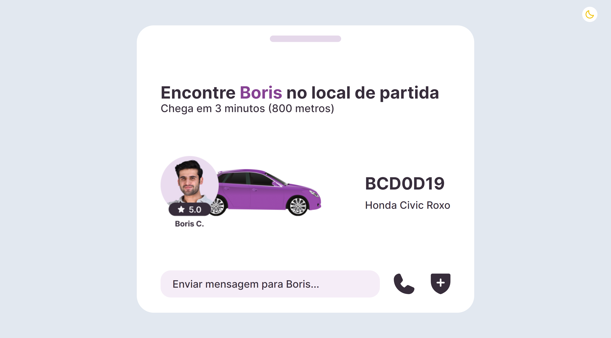

<h1 align="center"> Transporte Widget - BoraCodar#19 </h1>

[Clique aqui para acessar](https://maik-emanoel.github.io/transport-widget/)

## 🚀 Tecnologias

Esse projeto foi desenvolvido com as seguintes tecnologias:

- HTML
- Tailwind CSS
- Javascript
- Git and Github

## 💻 Projeto

O Transporte Widget é uma interface que utilizei do #boraCodar19 para testar minhas habilidades com o Tailwind CSS.  

Projeto construído a partir do layout proposto no desafio [#BoraCodar19](https://boracodar.dev/) realizado pela [Rocketseat](https://rocketseat.com.br).
Após o desenvolvimento do projeto inicial, adicionei novas features, tais quais:

- Layout responsivo (Adaptado para telas menores);
- Efeitos hover;
- Modo Dark;
- Entre outras pequenas modificações.